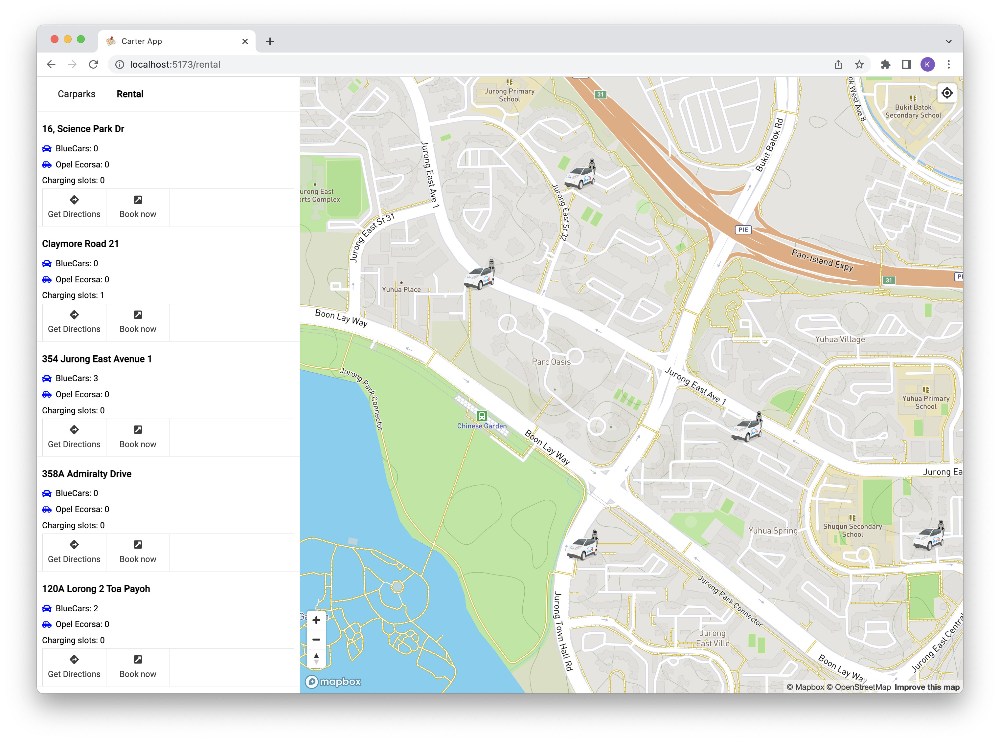

# carter

This web application allows users to check public carpark statuses, rental car availability and more.

## Objectives

1. Rental of cars
2. Carpark recommender
3. Cost Tracker
4. Routing
5. Point of interest recommendation
6. Text to Speech for searching options while driving or readback to drivers when they are driving (optional)

## Deployment

This web app is deployed automatically to Cloudflare pages.
