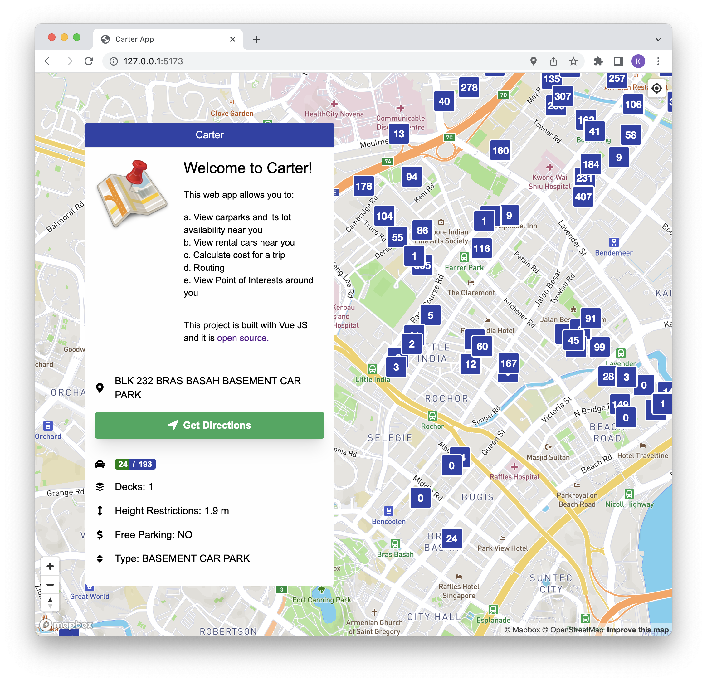

# carter

With the rising car prices currently, rental cars have been in trend, such as GetGo or BlueSG. However, we would like to provide an opportunity for car owners to earn extra income. Hence, our app allows car owners to rent out their cars using our platform, earning them a couple extra bucks, to survive the increasing expenses of owning a car.

When rentees go out, they do not have easy access to information on the ideal car park: which car park has the best rates, the nearest to us, and has ample available lots. We want to reduce the rentees’ time spent searching for lots or waiting for lots to be vacant by recommending carparks that have available lots in the vicinity of the rentees.

Our app also provides GPS services for rentees to find their destination and at the same time recommends nearby points of interest for them to visit. Rentees are also able to track their cost they are incurring as they are renting the car.

## Objectives

1. Rental of cars
2. Carpark recommender
3. Cost Tracker
4. Routing
5. Point of interest recommendation
6. Text to Speech for searching options while driving or readback to drivers when they are driving (optional)

## Deployment

This web app is deployed automatically to Cloudflare pages.
